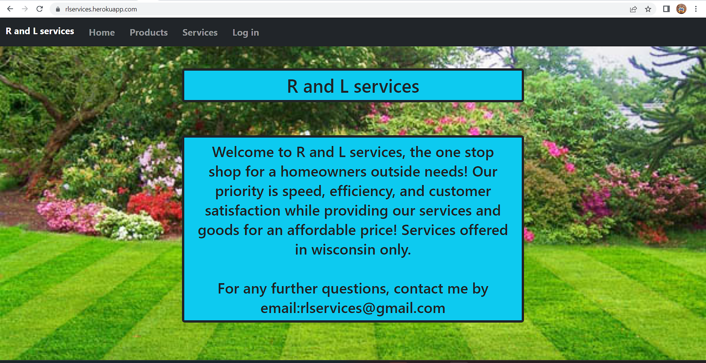
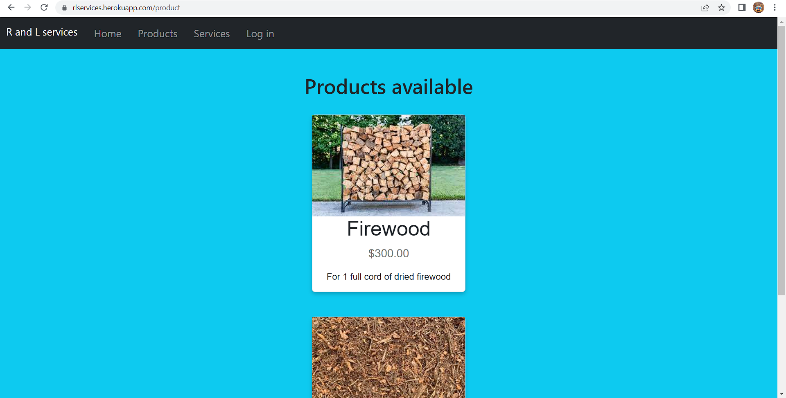
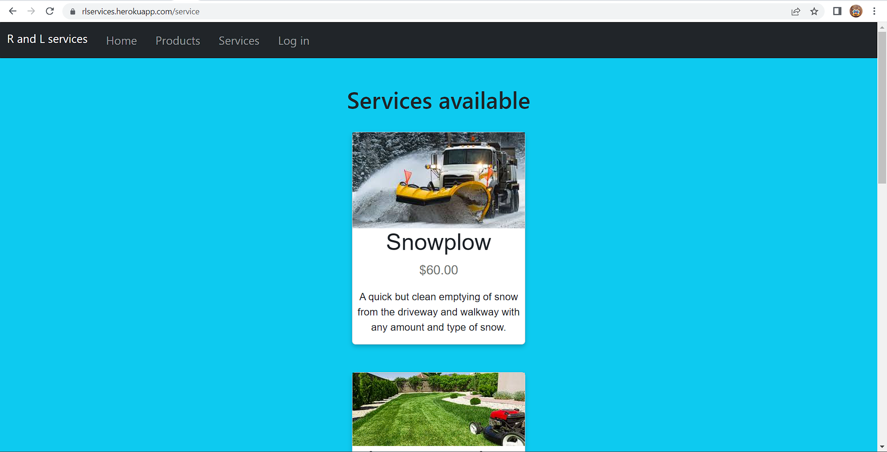
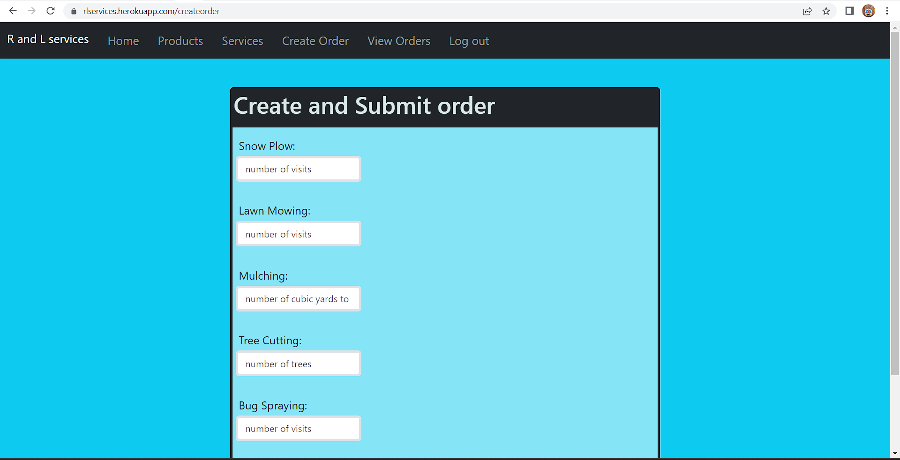

# R and L Services
## Description
This is a website that offers products and services to order. There is a home page, services and products pages, then you need to create an account or login with an account you already created to get access to creating an order along with viewing already existing orders. The page to view orders shows an order number, the users first name, and what the ordered along with the amount of what they ordered. 

The inspiration for this project was from a cousin who would like me to build a website for him and his son Ryan and Lucas to have a website to sell their services as well as word of mouth. I plan to expand on the qualility and features after the class ends to his wants. This project is powered by JavaScript, handlebars for the html and bootsrap for most of the styling with some tweaks. This is what I made for my project 2.

## User story
As a seller
I want people to be able to order my products and services online
SO that I can advertise and close purchases easier

## images
Home page view

Products advertised page

Services advertised page

Create order form

View for all orders

## Deployed link
https://rlservices.herokuapp.com/
